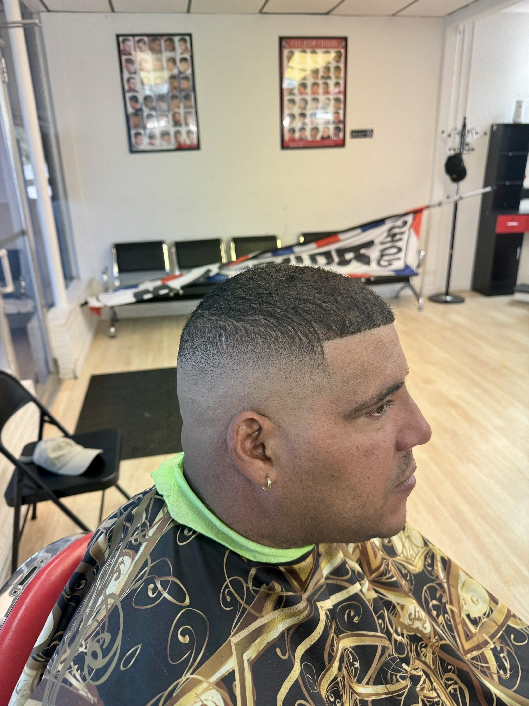

# Performance Optimization Guide

## Completed Optimizations

### 1. HTML Performance Improvements
- ✅ Added `defer` attribute to ScrollReveal script to prevent render blocking
- ✅ Added preconnect hints for external CDN resources (cdn.jsdelivr.net, unpkg.com)
- ✅ Added DNS prefetch for Google Maps
- ✅ Added `decoding="async"` to all images for better parallelization
- ✅ Added `fetchpriority="high"` to logo for faster above-the-fold rendering
- ✅ Fixed image file references (corte2, corte5, corte9 now use correct .jpg extension)
- ✅ Removed duplicate corte2.jpeg file (saved 2.6MB)

### 2. CSS Performance Improvements
- ✅ Added `will-change: transform` to gallery images to optimize hover animations
- ✅ Added `content-visibility: auto` to hero section for better rendering performance

### 3. JavaScript Optimizations
- ✅ Consolidated inline scripts into a single block
- ✅ Used `Object.keys().forEach()` for safe property iteration
- ✅ Added safety check for ScrollReveal initialization

## Recommended Future Optimizations

### Image Optimization (HIGH PRIORITY)
The following images should be optimized to reduce file sizes:

**Large Images (2-3MB):**
- `interior1.jpg` (3.1MB) - Hero background image
- `corte2.jpg` (2.5MB)
- `corte5.jpg` (2.6MB)
- `corte9.jpg` (2.6MB)

**Medium Images (900KB-1.3MB):**
- `logo.png` (944KB) - Consider converting to WebP or optimizing PNG
- `corte1.JPG` (1.3MB)

**Optimization Strategies:**

1. **Use modern image formats:**
   ```html
   <picture>
     <source srcset="assets/corte1.webp" type="image/webp">
     
   </picture>
   ```

2. **Compress images:** Use tools like:
   - ImageOptim (Mac)
   - TinyPNG/TinyJPG (Online)
   - squoosh.app (Online, Google)
   - imagemagick CLI: `convert input.jpg -quality 85 output.jpg`

3. **Responsive images:** Provide different sizes for different screen sizes:
   ```html
   
   ```

### Additional Recommendations

1. **Consider a build process:**
   - Minify CSS and JavaScript
   - Automatically optimize images during build
   - Use a bundler like Vite or Parcel

2. **Enable compression:**
   - Configure Netlify to enable Brotli/Gzip compression
   - Already supported by default on Netlify

3. **Add a Service Worker:**
   - Cache static assets for offline support
   - Improve repeat visit performance

4. **Lazy load the Google Maps iframe:**
   - Only load when user scrolls near the contact section
   - Use Intersection Observer API

## Performance Metrics

### Before Optimization:
- Total page size: ~17MB (images)
- Render blocking scripts: 1 (ScrollReveal)
- Image format issues: 3 file reference mismatches
- Duplicate files: 1 (2.6MB)

### After Current Optimization:
- Total page size: ~14.4MB (removed 2.6MB duplicate)
- Render blocking scripts: 0
- Image format issues: 0
- Duplicate files: 0
- Added performance hints and attributes throughout

### Target Metrics (with image optimization):
- Total page size: <3MB (estimated with optimized images)
- First Contentful Paint: <1.5s
- Largest Contentful Paint: <2.5s
- Time to Interactive: <3.5s

## Testing Performance

Test your site performance with:
1. **Google PageSpeed Insights**: https://pagespeed.web.dev/
2. **WebPageTest**: https://www.webpagetest.org/
3. **Chrome DevTools Lighthouse**: Built into Chrome browser

## Implementation Priority

1. ✅ **DONE**: Fix render-blocking resources (scripts with defer)
2. ✅ **DONE**: Add resource hints (preconnect, dns-prefetch)
3. ✅ **DONE**: Fix image reference issues
4. ✅ **DONE**: Remove duplicate files
5. **TODO**: Optimize image file sizes (HIGH PRIORITY - would reduce page size by ~75%)
6. **TODO**: Convert to WebP format (MEDIUM PRIORITY)
7. **TODO**: Add responsive images (MEDIUM PRIORITY)
8. **TODO**: Implement lazy loading for iframe (LOW PRIORITY)
